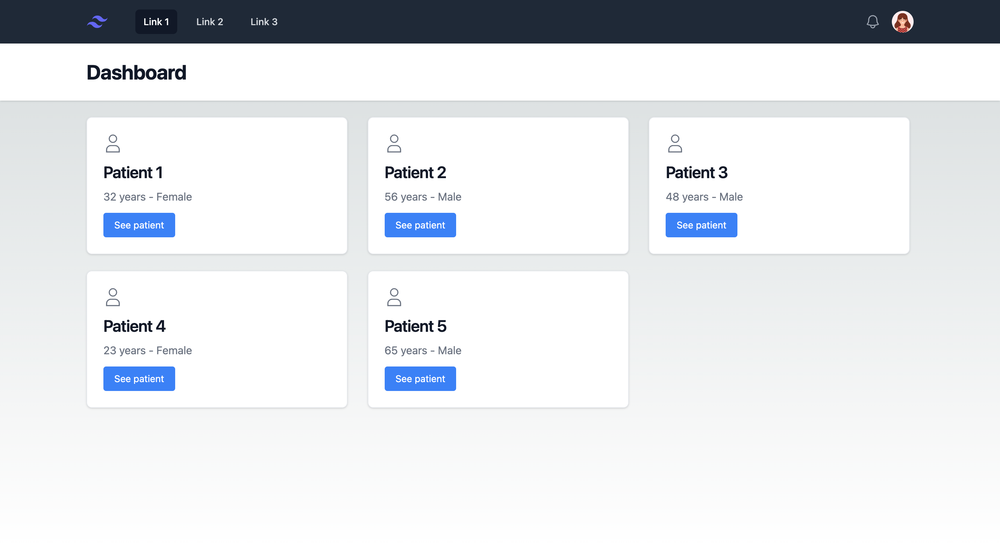
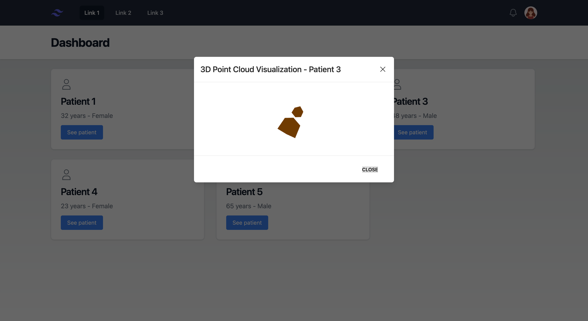
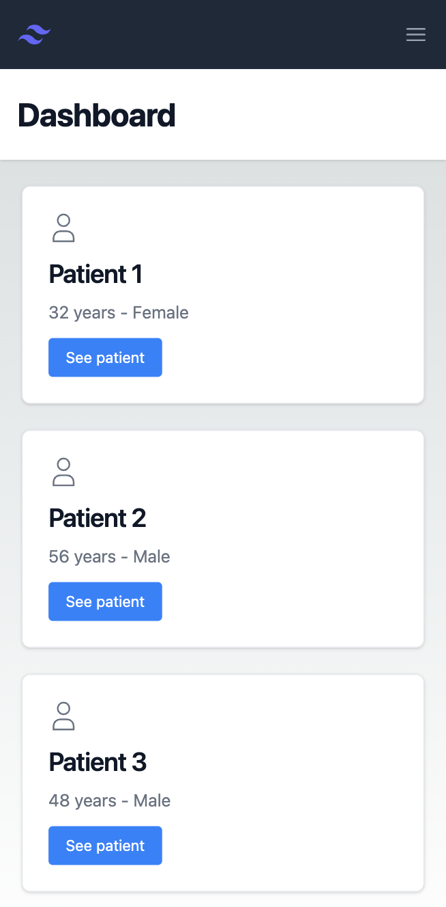
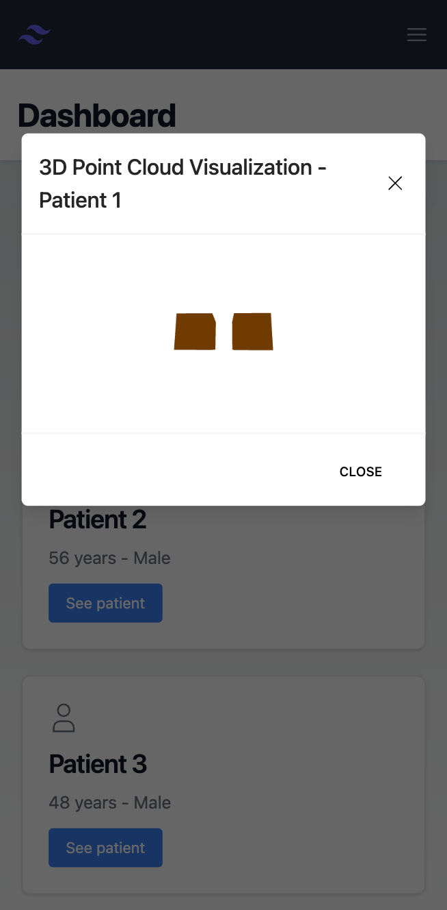

<h1 align="center">Single Page Application - Basic Patient Information Dashboard</h1>

Building a Basic Patient Information Dashboard with a 3D Visualizer

## ✨ Features

- 👤 Display Basic Patient Information
- 🔎 3D Point Cloud Visualization
- 🔄 Refresh Content
- 📱 Responsive


## 🖥️ Screens

| [](http://godban.github.io/browsers-support-badges/)<br>Web Home | [](http://godban.github.io/browsers-support-badges/)<br>Web Modal 
| --- | --- | 

| [](http://godban.github.io/browsers-support-badges/)<br>Phone Home | [](http://godban.github.io/browsers-support-badges/)<br>Phone Modal
| --- | --- |

## 📦 Install

Clone locally:

```bash
$ git clone git@github.com:KarolHarumi/patient-information-dashboard.git
$ npm install
```

## ⌨️ Development

```bash
npm run dev
# or
yarn dev
# or
pnpm dev
```

Open [http://localhost:3000](http://localhost:3000) with your browser to see the result.

You can start editing the page by modifying `app/page.tsx`. The page auto-updates as you edit the file.

This project uses [`next/font`](https://nextjs.org/docs/basic-features/font-optimization) to automatically optimize and load Inter, a custom Google Font.

## 👷🏼‍♀️ TODO
- [ ] Refresh button
- [ ] Get 3d content from API 

## 💫 Improvements
- [ ] Add Toast component to provide users with feedback on success and errors

## ⚠️ FYI
- An intermittent error appears on the console: `app-index.js:31 Warning: Prop `id` did not match. Server: "headlessui-menu-button-:R1klmcq:" Client: "headlessui-menu-button-:R6impj9:"`, This issue is already known by the Next.js team. A fix is in progress and will be released soon. You can track the progress here: https://github.com/tailwindlabs/headlessui/issues/2606#issuecomment-1647907596
 

Run the project and enjoy!